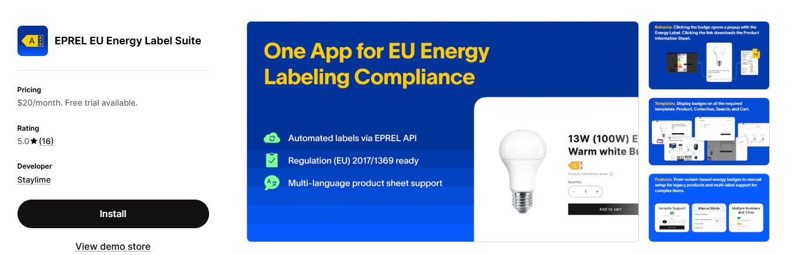
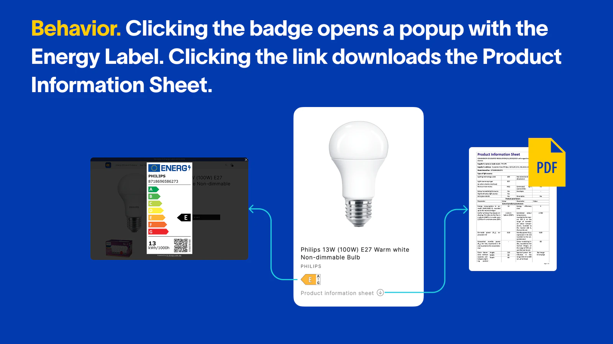

# Overview

<figure><figcaption></figcaption></figure>

Each badge shows the product's energy efficiency class and, when clicked, opens the corresponding energy label image. Customers can also download the official product information sheet in PDF format, available in multiple languages. All data is sourced from the EPREL database and kept up to date automatically.

<figure><figcaption></figcaption></figure>

***

### What's included

* Energy badges and labels on Product, Collection, Search, Cart, and Cart Drawer pages
* Automatic energy label updates via the EPREL API
* Multi-language product information sheet support
* Variants support — display per-variant labels using Shopify metafields
* Manual setup for legacy products not registered in EPREL

***

### Pricing


#### **$20/month**

Includes a **7-day free trial**.

Flat monthly pricing

Install directly from the Shopify App Store


<a href="https://apps.shopify.com/eu-energy-label" class="button primary">Start free trial on Shopify</a>
