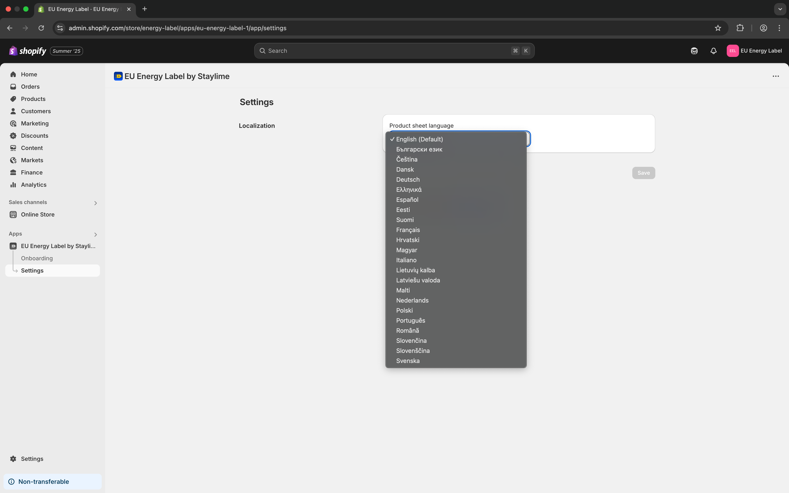

# Getting started



### Installing the app

You can install the EU Energy Label app directly from the Shopify App Store:

1. On the [app listing page](https://apps.shopify.com/eu-energy-label), click **Install**.
2. In your Shopify admin, confirm app permissions and click **Install** again to authorize.
3. After installation, select your subscription plan.

The app will then be available on the Apps page in your Shopify admin.



### Localization

Go to **Apps → EU Energy Label → Settings** and set your preferred language under **Product sheet language**.

This setting determines:

* The language of the product information sheet (`PDF`)
* The link text displayed next to the energy badge


The following languages are currently supported for product information sheets:\
🇬🇧 English (Default), 🇩🇪 Deutsch, 🇫🇷 Français, 🇪🇸 Español, 🇮🇹 Italiano, 🇳🇱 Nederlands, 🇵🇱 Polski, 🇸🇪 Svenska, 🇩🇰 Dansk, 🇫🇮 Suomi, 🇬🇷 Ελληνικά, 🇧🇬 Български, 🇨🇿 Čeština, 🇷🇴 Română, 🇭🇷 Hrvatski, 🇭🇺 Magyar, 🇪🇪 Eesti, 🇱🇹 Lietuvių, 🇱🇻 Latviešu, 🇸🇰 Slovenčina, 🇸🇮 Slovenščina, 🇲🇹 Malti, 🇵🇹 Português


<figure><figcaption></figcaption></figure>



### Enabling the app embed in your theme

To activate the energy labels across your storefront:

1. Go to **Online store → Themes** in your Shopify admin.
2. Click **Customize** next to the theme you want to use.
3. In the editor, open the **App embeds** panel (bottom left).
4. Toggle **Energy Label** to enable it.
5. Save your changes.

<figure><figcaption></figcaption></figure>



### Adding the Energy Label app block to the Product page

1. Go to **Online store → Themes → Edit theme** and open the **Product template**. Click **Add section**, switch to the **Apps** tab, and select **Energy Label**.
2. Drag the app block into place — ideally near the product price or buy button.
3. Adjust the block’s appearance using the available styling options.


**Link text** allows you to customize the wording for the **Product Information Sheet** text that appears next to the energy badge — it will override the default value.


<figure><figcaption></figcaption></figure>



### Assigning EPREL numbers to products

To display the correct energy badge, show the official energy label, and enable PDF download of the product information sheet, each energy-efficient product in your catalog must have its EPREL number assigned.

1. Go to **Products** in your Shopify admin.
2. Open the product you want to assign an EPREL number to. Scroll to the **Product metafields** section and locate the **EPREL Registration Number** field.
3. Enter a valid EPREL number and click **Save**.

Once saved, the storefront will display the official energy badge for that product. Clicking on the energy badge will open the pop-up with full energy label, and the product information sheet link will download a localized product fiche in PDF format.

Once saved, the storefront will display the official energy badge for that product. Clicking the badge opens a pop-up with the full energy label, while the product information sheet link downloads the localized fiche in PDF format.


The **product information sheet** will be downloaded in the language you selected earlier in [Step 2: Localization](getting-started.md#localization).


<figure><figcaption></figcaption></figure>

#### Assigning EPREL numbers in bulk

To assign EPREL numbers to multiple products at once, follow these steps:

1. In your Shopify admin, go to **Products** and select all relevant items. Click **Bulk edit**.
2. In the bulk editor view, click **Columns** in the top right corner. Scroll to **Metafields**, then check **EPREL Registration Number** to make the column visible.
3. Enter the correct EPREL number for each product in the newly visible field. Click **Save** in the top bar to apply the changes.

Once saved, the energy badges, labels, and product fiches will be available on the storefront for all products with valid EPREL numbers.

<figure><figcaption></figcaption></figure>


